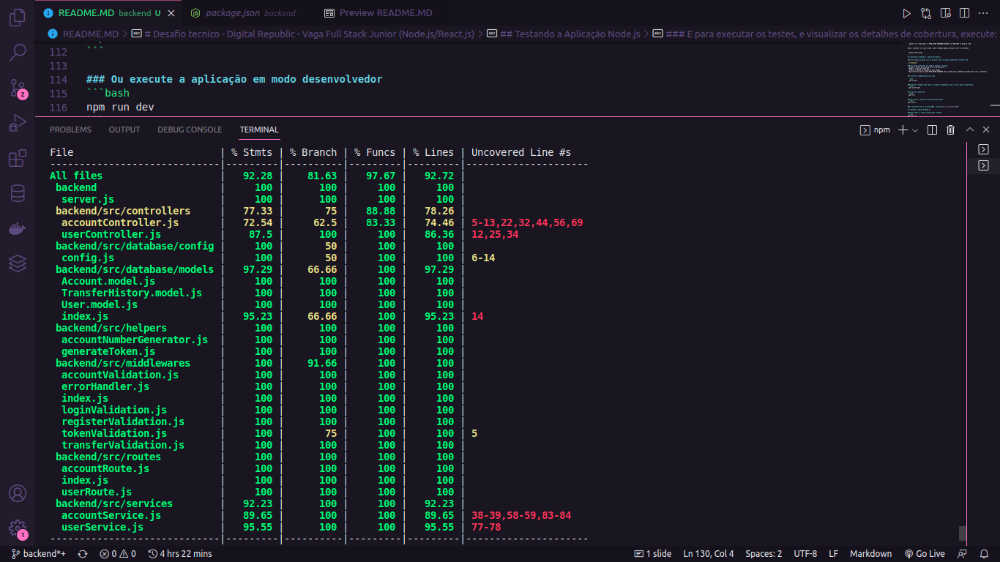
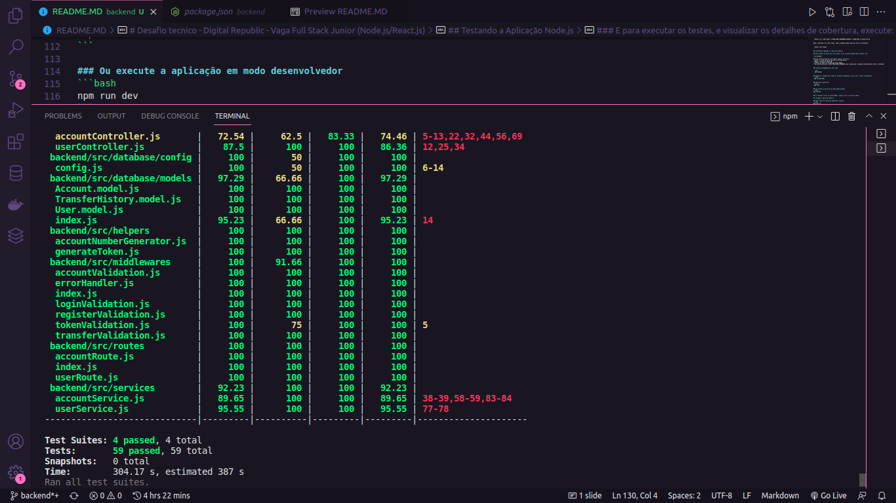
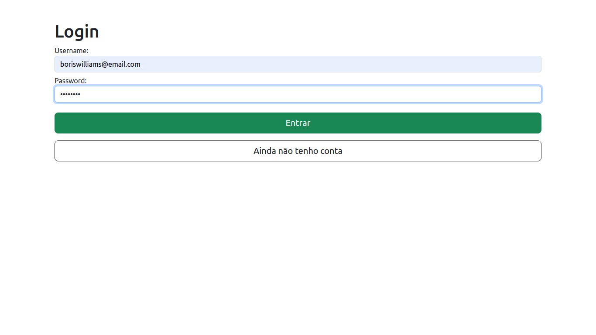
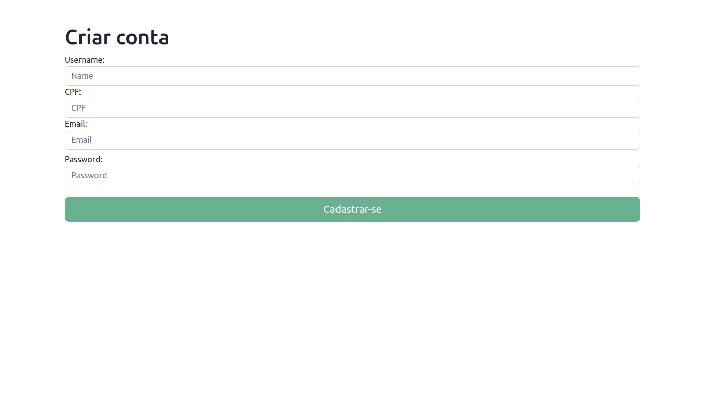
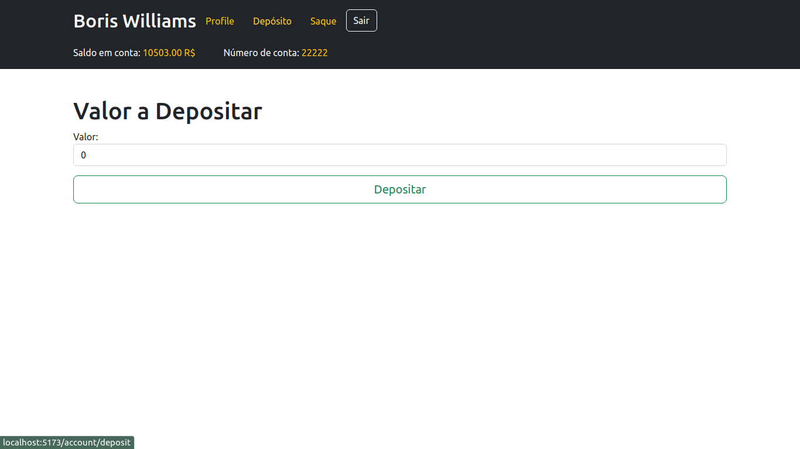
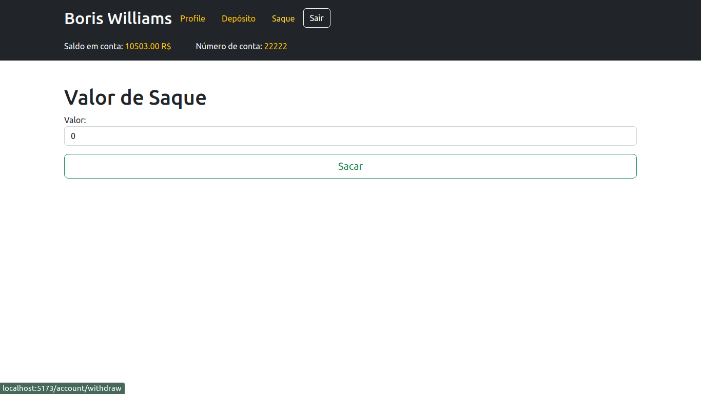
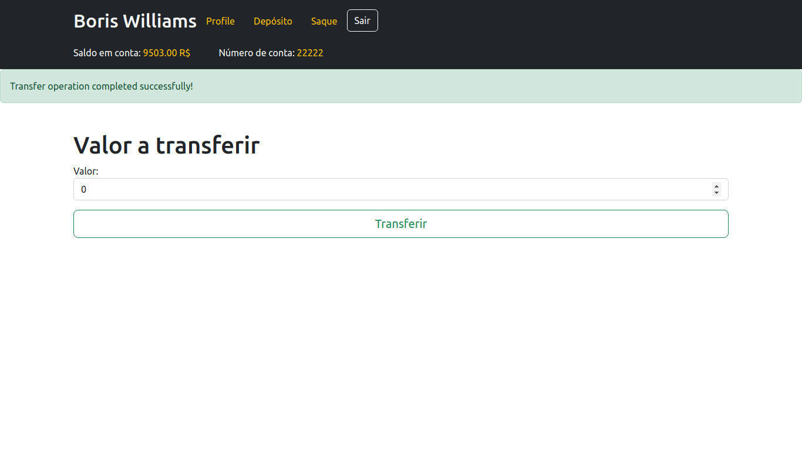

# Desafio tecnico - Digital Republic - Vaga Full Stack Junior (Node.js/React.js)

## Desafio de Backend

Seu **objetivo** é **criar uma API REST** com algumas **funções essenciais relacionadas** ao **gerenciamento de contas bancárias** em **uma** das linguagem: **Java, Kotlin, Python, Node.js, .NET**

- Para abrir uma conta é necessário apenas o nome completo e CPF da pessoa, mas só é permitido uma conta por pessoa;
- Com essa conta é possível realizar transferências para outras contas e depositar;
- Não aceitamos valores negativos nas contas;
- Por questão de segurança cada transação de depósito não pode ser maior do que R$2.000;
- As transferências entre contas são gratuitas e ilimitadas;

Em relação a **banco de dados**, **quem decide é você mesmo**.

Por favor, não esquecer de adicionar no README as instruções de como executar o projeto.

## O que avaliamos?

- Performance
Os algoritmos foram elabordos pensando na melhor performance do sistema?
- Testes
Testes unitários são importantes, faça a maior cobertura possível do seu código.
- Segurança
Verifique se não deixou informações sensíveis no repositório, como senhas de banco ou scripts com dados de usuário. Verifique se os métodos do sistema possuem validação que impeça chamadas não autorizadas a inserir ou modificar dados.
- Manutenabilidade:
O projeto foi estruturado de forma componentizada, facilitando o reuso de código, manutenção e entendimento do mesmo? As variáveis comuns ao projeto estão centralizadas em um arquivo de configuraçao?
- Princípios de programação
Foi capaz de utilizar principios fundamentais da programação (laços, condicionais, tipos de dados, etc)?
- Arquitetura de Software:
Seu software segue padrões de separação de camadas por responsabilidade? Os métodos estão coesos e com baixo acoplamento?


<h2>:rocket: Tecnologias</h2>

- [Vite](https://vitejs.dev/)
- [React](https://pt-br.reactjs.org/)
- [Node.js](https://nodejs.org/en/)
- [Express](https://expressjs.com/pt-br/)
- [jsonwebtoken](https://jwt.io/libraries)
- [Joi](https://joi.dev/)
- [Jest](https://jestjs.io/pt-BR/)
- [Supertest](https://github.com/ladjs/supertest)
- [Sequelize](https://sequelize.org/)
- [mysql2](https://www.npmjs.com/package/mysql2)
- [Axios](https://axios-http.com/ptbr/docs/intro)


<h2>:hammer_and_wrench: Features</h2>

- [x] Registrar usuário e conta
- [x] Realizar Login de usuário já registrado
- [x] Realizar Saque bancário
- [x] Realizar Depósito bancário
- [x] Realizar Transferência bancária

## :notebook: Instalando as aplicações

Para instalar o projeto backend, você vai precisar ter instalado em sua máquina as seguintes ferramentas:

 **Node**: [Download Node.js](https://nodejs.org/en/download/)
 
 **Git**: [Download Git](https://git-scm.com/downloads)

 **Docker**: [Download Docker](https://docs.docker.com/)

 ```bash
 # Clone este repositório
$ git clone  <git@github.com:Zeonnatios/digitalrepublic-code-challenge.git>
```

## Criando um container MySQL com Docker

Copie o comando abaixo e cole no terminal para criar um container mysql com docker:

* Talvez haja a necessidade de rodar os comandos com sudo. 
(Ex: sudo docker run...)

```
  docker run --name mysql -e MYSQL_ROOT_PASSWORD=12345678 -p 3306:3306 -d mysql:8.0.29
```

Após o container ter sido criado, rode o comando abaixo para dar start no container:

```
  docker start mysql    
```

## Instalando e Rodando o a aplicação Node.js

### Caso esteja na pasta raiz do projeto, entre na pasta backend pelo terminal com:

> cd backend/

### Você pode configurar seu próprio arquivo .env para:
- Editar o número da porta de serviço da aplicação.
- Mudar o secret do Token JWT
- Alterar os dados de conexão do banco MySQL. 
- De preferência que a senha MYSQL_ROOT_PASSWORD seja a mesma que o comando utilizado para criar o container.

> Exemplo

```
PORT=3000
MYSQL_HOST=localhost
MYSQL_PORT=3306
MYSQL_USER=root
MYSQL_PASSWORD=12345678
MYSQL_DB_NAME=bank-account-management
JWT_SECRET=secret_key
```

> Por padrão o Backend estará rodando na porta 3000


### Instale as dependências com o npm ou com o yarn
```bash
  npm install
  
  yarn install
```

### Execute o comando para rodar os scripts do Sequelize, para criar o banco e migrations:
```bash
  npm run db:reset

  yarn run db:reset
```

### Execute a aplicação:
```bash
  npm start

  yarn start
```

### Também pode executar a aplicação em modo desenvolvedor
```bash
  npm run dev

  yarn dev
```

> O servidor inciará na porta:3000 por padrão


## Instalando e Rodando o a aplicação React JS

### Caso esteja na pasta raiz do projeto, entre na pasta backend pelo terminal com:

> cd frontend/

> Pelo padrão da porta backend funcionar na 3000, todos os endpoints estão estáticos, fazendo requisições pelo link localhost:3000/

> Para que a aplicação funcione corretamente, é necessário ter dado start no container do docker com mysql, executado o script yarn run db:rest e yarn dev ou yarn start, no projeto backend. Para o banco de dados e a API estarem operacionais.

### Instale as dependências com o npm ou com o yarn
```bash
  npm install
  
  yarn install
```

### Execute a aplicação:
```bash
  npm start

  yarn start
```

> A página inciará na porta:5173 pelo padrão do Vite


## Testando a Aplicação Node.js

### Para rodar os testes da aplicação, execute:
```bash
  npm run test

  yarn test
```

### E para executar os testes, e visualizar os detalhes de cobertura, execute:
```bash
  npm run test-coverage

  yarn test-coverage
```



## Endpoints
This API has the following endpoints:

| Method | Description |
|---|---|
| `GET - localhost:3000/users` | Retorna todos os usuários no banco de dados. |
| `GET - localhost:3000/accounts/` | Retorna todas as contas bancárias no banco de dados. |
| `GET - localhost:3000/account/:id` | Busca uma conta pelo Id. |
| `POST - localhost:3000/user/register` | Cria um usuário e conta bancária vinculada, e retorna um token. |
| `POST - localhost:3000/login` | Retorna um token ao passar email e senha. |
| `PATCH - localhost:3000/account/deposit/` | Realiza um depósito na própria conta, e retorna os dados da conta. |
| `PATCH - localhost:3000/account/withdraw/` | Realiza um saque da própria conta, e retorna os dados da conta. |
| `PATCH - localhost:3000/account/transfer:accountNumber/` | Realiza uma transferência de sua conta para outra, e retorna os dados da transferência. |


## Páginas
### Página de Login


### Página de Cadastro


### Página de Perfil


### Página de Depósito


### Página de Saque


### Página de Transferência



## Desenvolvido por

<div align="left">
  <a href="https://github.com/Zeonnatios">
    <div align="left">
      
      <br />
      <b>Matheus Antonio</b>
    </div>
  </a>
  <br />
  <a href="https://www.linkedin.com/in/matheusantoniosilva" title="Linkedin Matheus Antonio">Meu Linkedin</a>
</div>
